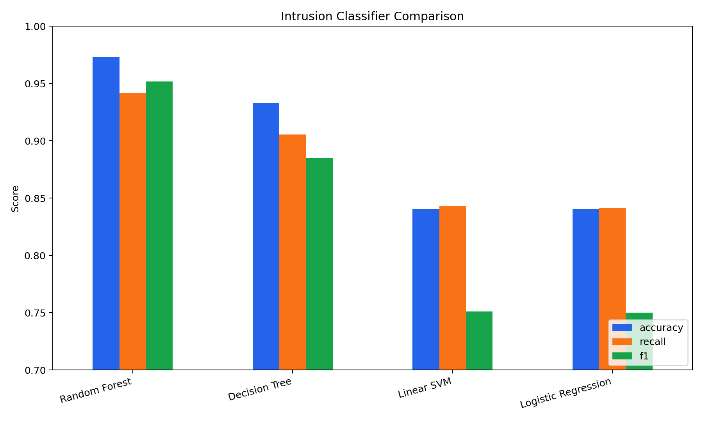
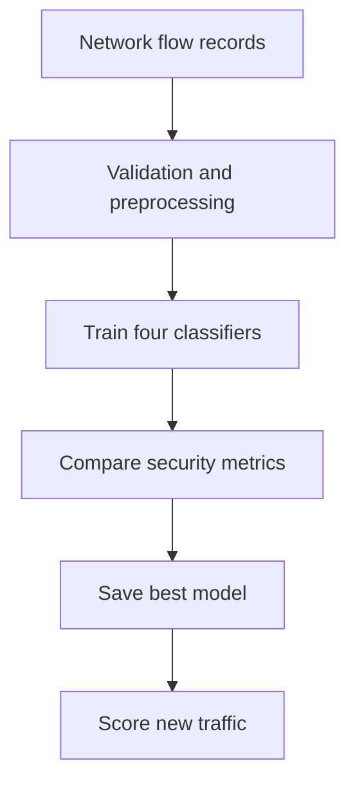

# Machine Learning Network Intrusion Detection

Portfolio demonstration of an end-to-end classification workflow that labels network flows as normal or malicious. The repository generates a reproducible 120,000-row synthetic dataset, compares four classifiers, and exports model evaluation artifacts.

> Portfolio note: the included data is synthetic and contains no production or confidential network traffic. The project is designed to demonstrate the same preprocessing, modeling, and evaluation workflow used with public intrusion-detection datasets.

## Business question

Can network-flow characteristics be used to identify suspicious traffic accurately enough to prioritize alerts for a security operations team?

## What this repository demonstrates

- Reproducible data generation and train/test splitting
- Missing-value handling and feature scaling through scikit-learn pipelines
- Logistic Regression, Decision Tree, Random Forest, and Linear SVM comparison
- Accuracy, precision, recall, F1, ROC-AUC, and confusion-matrix evaluation
- Saved model and command-line prediction example
- Automated tests for data shape and prediction behavior



## Architecture



## Repository structure

```text
data/                 Generated dataset (not committed by default)
docs/                 Model card and project documentation
outputs/              Metrics, charts, and serialized model
src/generate_data.py  Deterministic 120k-row data generator
src/train.py          Training and evaluation pipeline
src/predict.py        Example inference command
tests/                 Automated checks
```

## Quick start

```bash
python -m venv .venv
source .venv/bin/activate       # Windows: .venv\Scripts\activate
pip install -r requirements.txt
python src/generate_data.py
python src/train.py
python src/predict.py
python -m unittest discover -s tests -v
```

Generated evidence appears in `outputs/`:

- `metrics.json` - full model comparison
- `model_comparison.png` - F1, recall, and accuracy chart
- `confusion_matrix.png` - selected-model error breakdown
- `feature_importance.png` - leading Random Forest signals
- `best_model.joblib` - fitted preprocessing and model pipeline

## Interview talking points

1. In intrusion detection, recall is important because a false negative means malicious traffic was missed.
2. Precision is also monitored because too many false positives create alert fatigue.
3. The final model is selected primarily by F1, which balances both concerns.
4. Synthetic data makes the demo safe and reproducible; a production version would retrain on approved, time-stamped traffic and monitor drift.

## Limitations

- Synthetic flows are less complex than a live network.
- A random train/test split does not measure temporal drift.
- This is a portfolio demonstration, not a production security control.

## License

MIT
